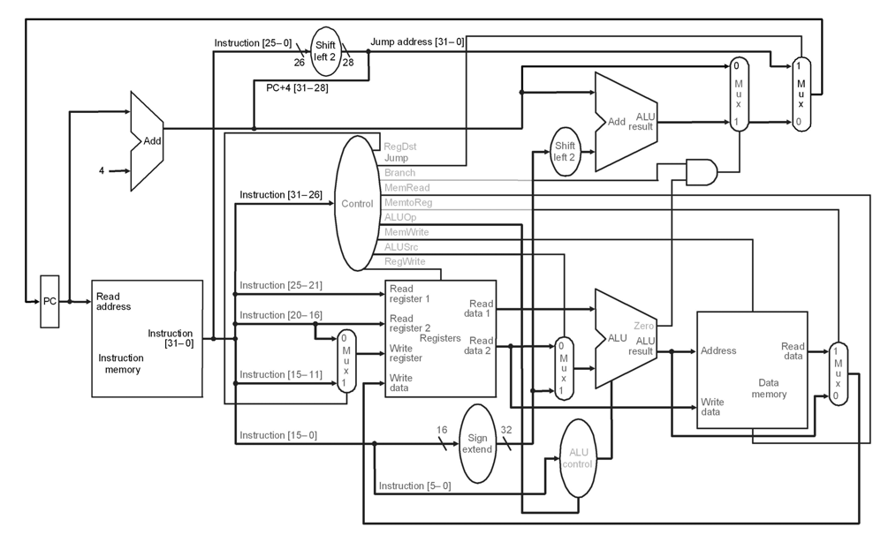

# Single Cycle MIPS Implementation with VHDL
Single Cycle MIPS implementations using Xilinx ISE Design Suite 14.7 with VHDL.

## Design
The datapath that is used for as a reference in this project.

## Components
- Program Counter (`ProgramCounter.vhd`)
- Program Counter Adder (`ProgramCounterAdder.vhd`)
- Instruction Memory (`InstructionMemory.vhd`)
- Register File (`RegisterFile.vhd`)
- Mux (`Multiplexer.vhd`)
- Sign Extender (`SignExtender.vhd`)
- Shift Lefter (`ShifLefter.vhd`)
- ALU (`ArithmeticLogicUnit.vhd`)
- ALU Control (`ArithmeticLogicUnitController.vhd`)
- Data Memory (`DataMemory.vhd`)
- Control Unit (`ControlUnit.vhd`)

## Supported Instructions
- add (Addition)
- sub (Subtraction)
- and (Bitwise And)
- or  (Bitwise Or)
- slt (Set Less Than)
- lw  (Load Word)
- sw  (Store Word)
- beq (Branch Equal)
- bne (Branch Not Equal)
- j   (Jump)

## Simulation
The instructions are avalaible in `InstructionMemory.vhd`. Results are down below.

